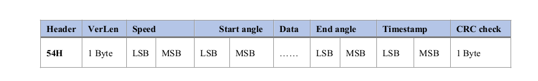
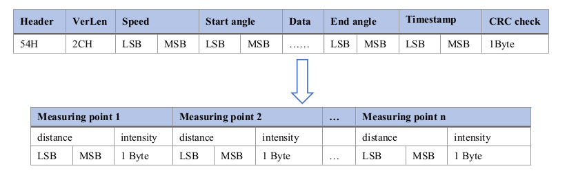

# LD_D500

*Estas librarís están basadas en este repositorio: https://github.com/covao/LidarLD19*

- Comunicación UART.
- Frecuencia de baudios: 230400 bauds

## [Oficial_documet](./oficial_docs/LD19_Development_Manual_v2.5.pdf)

## [Librerias](./librerias/)

### - [Python](./librerias/python/LD_D500.py)
### - [C++](./librerias/c++/LD_D500.h)

## LD_D500 ICD

Este es el ICD del dispositivo.

| Posición | Valor |
|----------|-------|
|    0	  | 0x54 |
|    1	  | Tipo de mensaje (0x2C) |
|    2	  | Velocidad (LSB) |
|    3	  | Velocidad |
|    4	  | Ángulo de inicio x100 (LSB) |
|    5	  | Ángulo de inicio x100 (MSB) |
|    6	  | Distancia 1 [mm] (LSB) |
|    7	  | Distancia 1 [mm] (MSB) |
|    8	  | Intensidad 1 |
|    9	  | Distancia 2 [mm] (LSB) |
|    10    | Distancia 2 [mm] (MSB) |
|    11    | Intensidad 2 |
|    12    | Distancia 3 [mm] (LSB) |
|    13    | Distancia 3 [mm] (MSB) |
|    14    | Intensidad 3 |
|    15    | Distancia 4 [mm] (LSB) |
|    16    | Distancia 4 [mm] (MSB) |
|    17    | Intensidad 4 |
|    18    | Distancia 5 [mm] (LSB) |
|    19    | Distancia 5 [mm] (MSB) |
|    20    | Intensidad 5 |
|    21    | Distancia 6 [mm] (LSB) |
|    22    | Distancia 6 [mm] (MSB) |
|    23    | Intensidad 6 |
|    24    | Distancia 7 [mm] (LSB) |
|    25    | Distancia 7 [mm] (MSB) |
|    26    | Intensidad 7 |
|    27    | Distancia 8 [mm] (LSB) |
|    28    | Distancia 8 [mm] (MSB) |
|    29    | Intensidad 8 |
|    30    | Distancia 9 [mm] (LSB) |
|    31    | Distancia 9 [mm] (MSB) |
|    32    | Intensidad 9 |
|    33    | Distancia 10 [mm] (LSB) |
|    34    | Distancia 10 [mm] (MSB) |
|    35    | Intensidad 10 |
|    36    | Distancia 11 [mm] (LSB) |
|    37    | Distancia 11 [mm] (MSB) |
|    38    | Intensidad 11 |
|    39    | Distancia 12 [mm] (LSB) |
|    40    | Distancia 12 [mm] (MSB) |
|    41    | Intensidad 12 |
|    42    | Ángulo de final x100 (LSB) |
|    43    | Ángulo de final x100 (MSB) |
|    44    | Marca de tiempo (LSB)	 |
|    45    | Marca de tiempo (MSB)	 |
|    46    | CRC	 |

### Other references
- https://wiki.youyeetoo.com/en/Lidar/D300 
- https://github.com/covao/LidarLD19/blob/main/LidarLD19.md 

